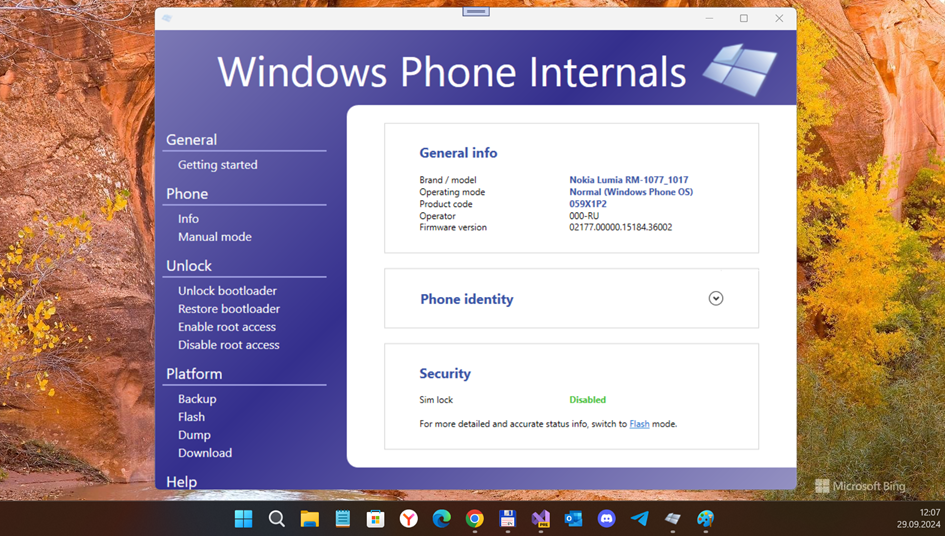
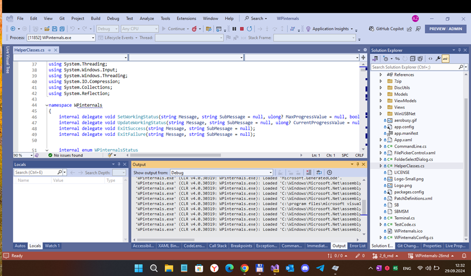

# Windows Phone Internals - andromeda branch

My WPI2.6-based "fork" , special for Windows Core 17686build (mobile os)

## About the original
Windows Phone Internals (WPinternals or WPI for short) is a tool designed to unlock the bootloader and/or secure boot of select Lumia devices made by Nokia and Microsoft.
Thanks to specifically crafted exploits/techniques the tool is able to disable Bootloader Security/SecureBoot on select Lumia models.

## Screenshots

## What is it / what it could be? (future plans / scenario)
After unlocking your bootloader you will be able to notably perform the following actions:
- Boot other Operating Systems (Andromeda 17686?)
- Enable Root Access on select OS versions (Root Access is a set of patches/hacks disabling security inside Windows Phone at its root. Kernel Security, Permission checks, application container security, deployment capability security and much gets disabled as part of enabling root access)
- Flash Custom ROMs
- Backup your current Windows Phone ROM
- Access your phone internal storage over USB

## How some dev to get started?
- git clone --recursive https://github.com/mediaexplorer74/WPinternals
- start your VS 2022 as/under Administrator, then open WPInternal solution.
- try to connect your Lumia device (for example, Lumia 950 with W10M "Andromeda") and start WPI debugging :)
- research continous "Waiting device connection" problem and try to fix it...  

## Credits
- https://github.com/ReneLergner Rene Lergner, Gustave Monce & other great C# dev
- https://github.com/ReneLergner/WPinternals Original WPinternals

## ::
As is. No support. RnD only. DIY.

## mediaexplorer 2024
